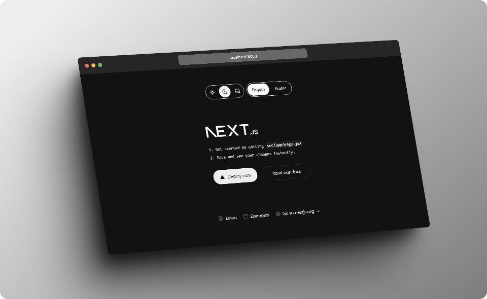

# 🌐 Next.js 15 Template

A robust template for building Next.js 15 applications with theme switching, multi-language support (RTL and LTR), UI components from Shadcn, Tailwind CSS, JavaScript, and ESLint for linting.

<div align="center">
 
</div>


## 🚀 Features

- **🌗 Theme Changer**: Supports dark, light, and system themes using `next-themes`.
- **🌍 Multi-language Support**: RTL and LTR languages with `next-intl`.
- **🛠️ UI Components**: Built using Shadcn.
- **🎨 Tailwind CSS**: Modern styling with Tailwind CSS.
- **💻 JavaScript**: Written in JavaScript (no TypeScript).
- **🔍 ESLint**: Configured for code linting.

---

## 📁 Project Structure

```plaintext
│   .eslintrc.json
│   .gitignore
│   components.json
│   jsconfig.json
│   next.config.mjs
│   package-lock.json
│   package.json
│   postcss.config.mjs
│   README.md
│   tailwind.config.js
│
├───messages
│       ar.json
│       en.json
│
├───public
│       file-text.svg
│       globe.svg
│       next.svg
|       shot.png
│       vercel.svg
│       window.svg
│
└───src
    │   i18n.js
    │   middleware.js
    │
    ├───app
    │   │   favicon.ico
    │   │   globals.css
    │   │   layout.jsx
    │   │   not-found.jsx
    │   │   page.jsx
    │   │
    │   ├───fonts
    │   │       GeistMonoVF.woff
    │   │       GeistVF.woff
    │   │
    │   └───[locale]
    │           layout.jsx
    │           page.jsx
    │
    ├───components
    │   │   LanguageChanger.jsx
    │   │   ThemeChanger.jsx
    │   │
    │   └───ui
    │           button.jsx
    │           select.jsx
    │
    ├───context
    │       ThemeProvider.jsx
    │
    └───lib
            utils.js
```

---

## 🛠️ Installation

1. **Clone the repository**:
   ```bash
   git clone https://github.com/xmahdirz/nextjs-15-template.git
   cd nextjs-15-template
   ```

2. **Install dependencies**:
   ```bash
   npm install
   ```

3. **Run the development server**:
   ```bash
   npm run dev
   ```

---

## ⚙️ Configuration

### Theme Changer

The theme changer, implemented using `next-themes`, supports:
- 🌞 Light
- 🌜 Dark
- 💻 System (follows system theme)

Component location: `src/components/ThemeChanger.jsx`.

### Language Support

Multi-language support with `next-intl`, including RTL and LTR directions.

Component location: `src/components/LanguageChanger.jsx`.

### Tailwind CSS

Tailwind CSS configuration can be found in `tailwind.config.js`.

### ESLint

ESLint configuration is located in `.eslintrc.json`.

---

## 🧩 Components

### LanguageChanger.jsx

Handles language switching between English and Arabic with theme support.

### ThemeChanger.jsx

Manages theme switching between light, dark, and system themes.

---

## 📜 License

This project is licensed under the MIT License.

---

Feel free to customize this README file according to your needs.